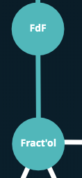
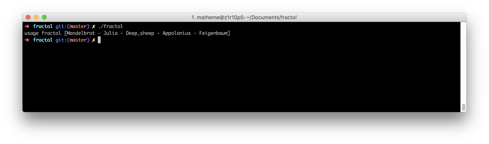
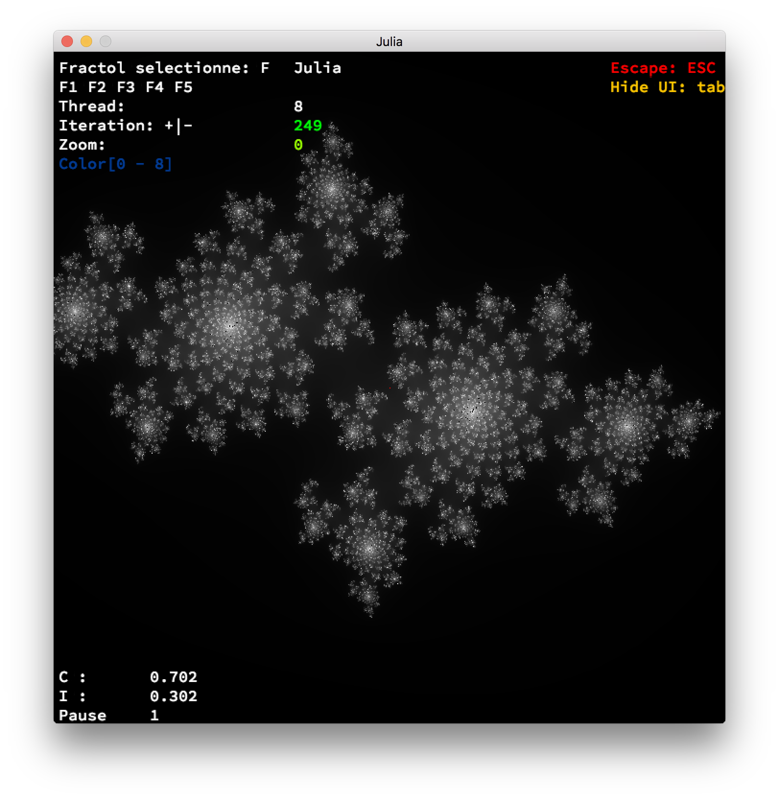
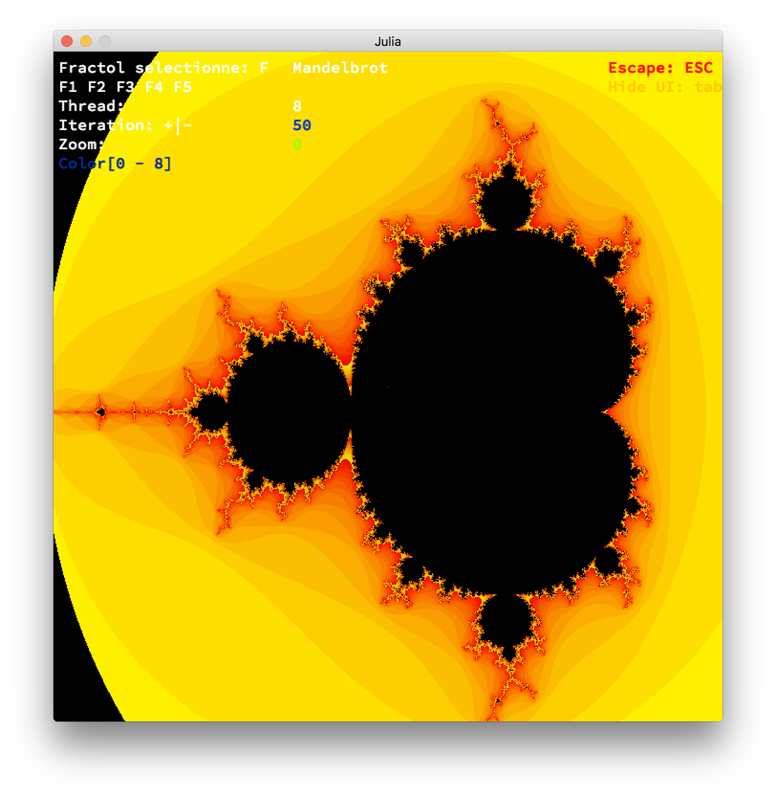
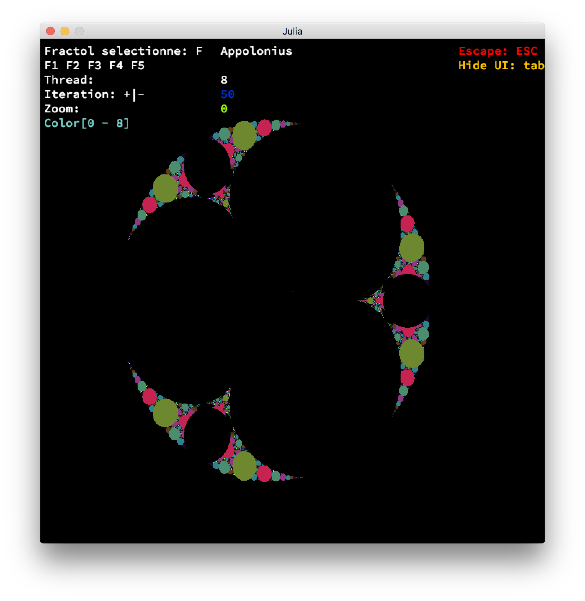
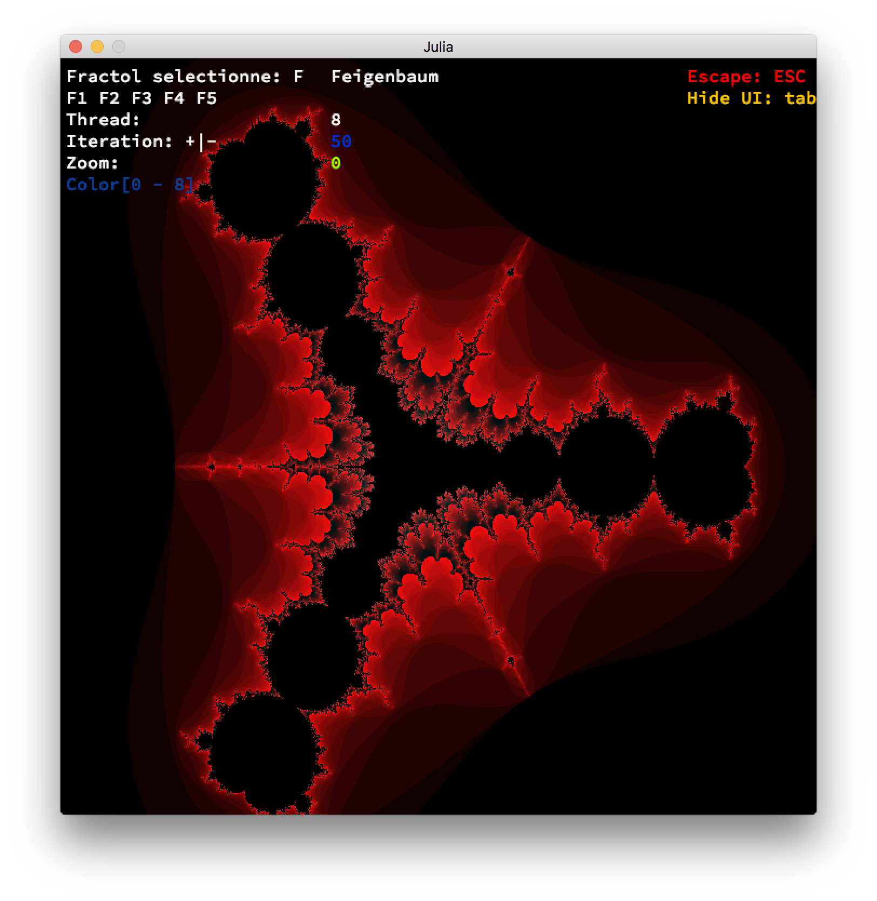
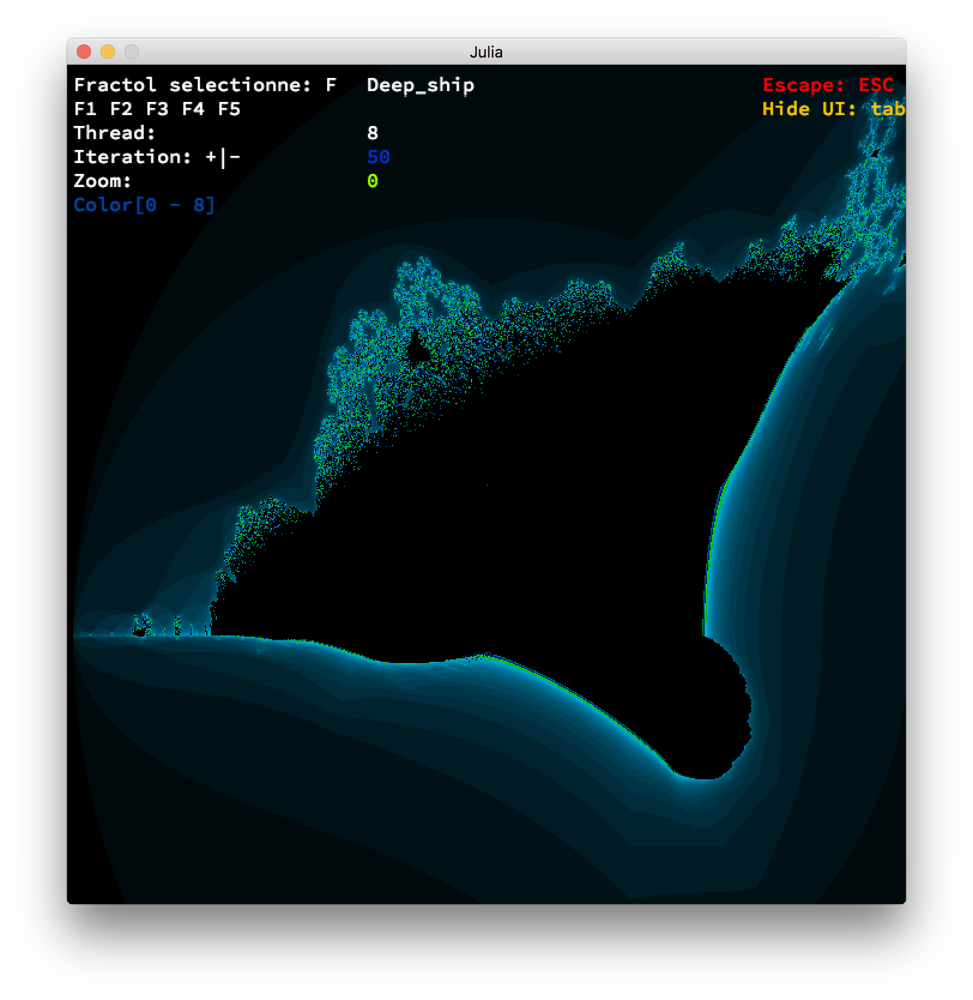
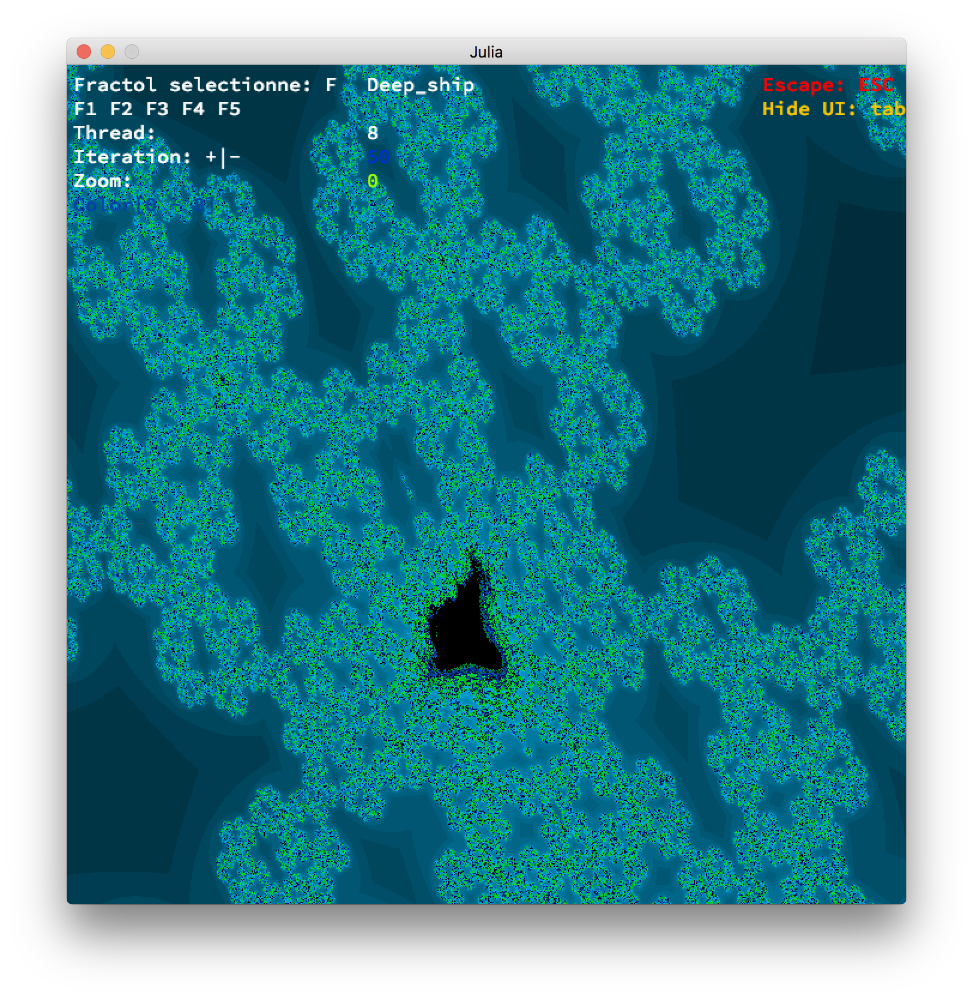
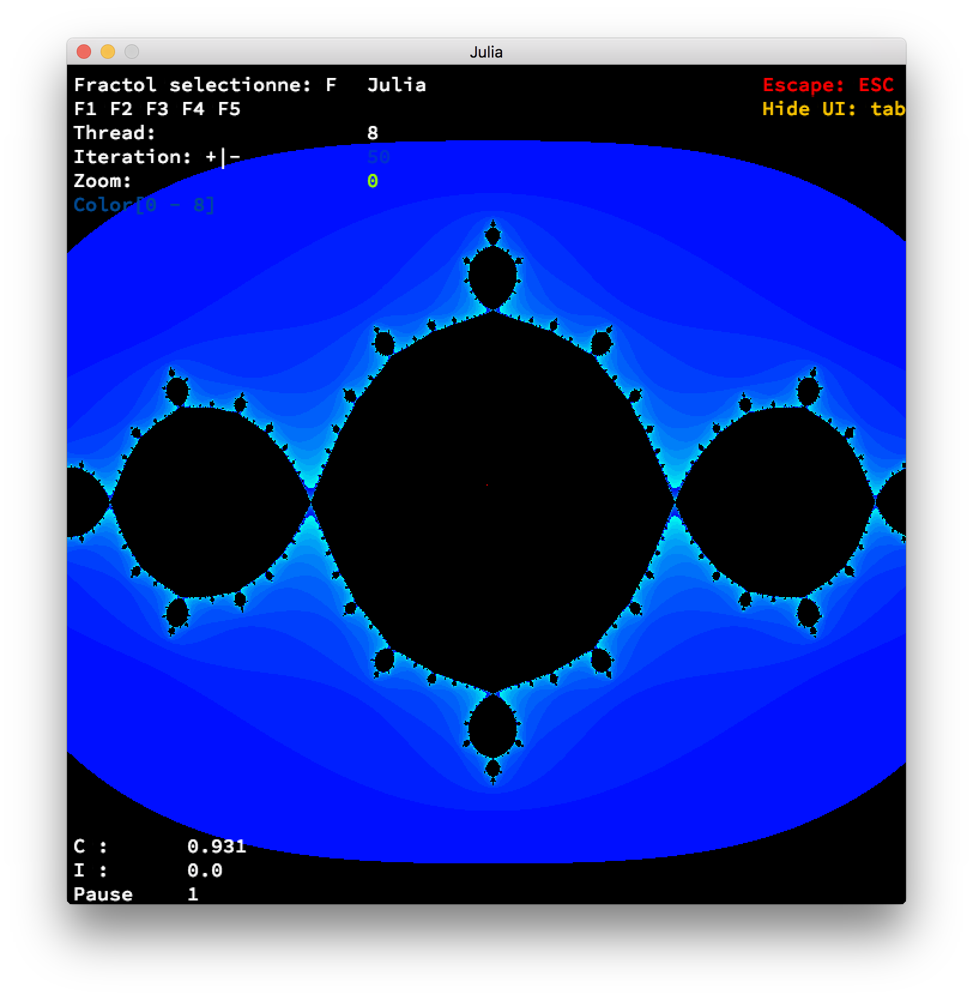
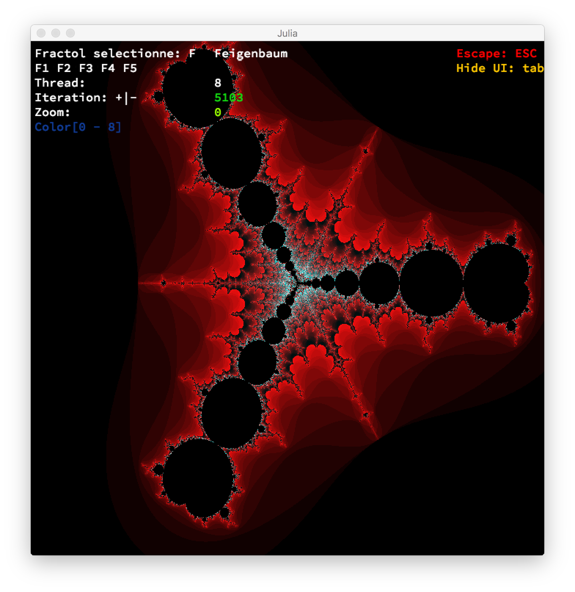

# 42 Cursus
fractol is the second project of the graphic branch of the cursus 42
fractol is a project in solo
I have use 2 libraries to realise this proejct
1 - my libft
2 - the minilibx (a graphic library of 42 school)

# 42-fractol
This project is meant to create graphically beautiful fractals

The term fractal was first used by mathematician Benoit Mandelbrot in 1974,
he based it on the Latin word fractus, meaning "broken" or "fractured".
A fractal is an abstract mathematical object, like a curve or a surface, which has a similar
pattern whatever the scale.

for more information please read the PDF of the subject.
I put the subject in ressources/subject

# Compiling and execute
Run the command `make` a the root of the repo then
you can run the programm with `./fractol fractal_name`
you have the choice between 5 fractal

# fractal selection
`Mandelbrot`
`Julia`
`Deep_sheep`
`Appolonius`
`Feigenbaum`

# Program output

